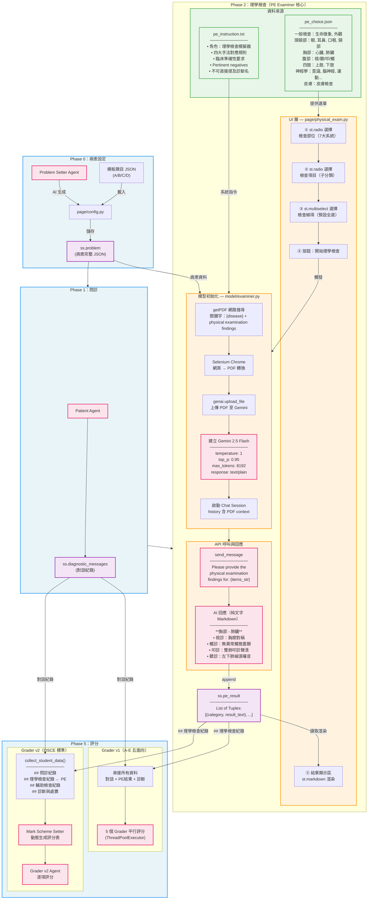
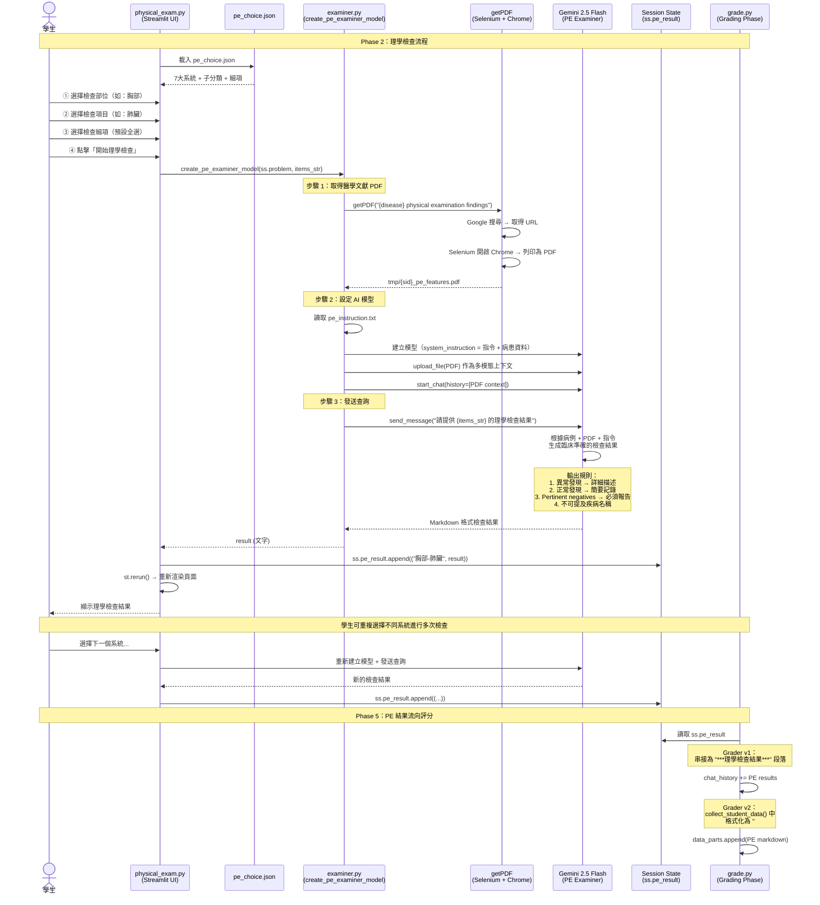

# PE Examiner 系統架構圖

## 完整資料流與系統互動

## PE Examiner 詳細互動序列圖

## 資料格式摘要

### 輸入資料
| 資料 | 來源 | 格式 |
|------|------|------|
| 病患資料 | ss.problem | JSON 字串 |
| 選擇的檢查項目 | pe_choice.json → UI | `"胸部 - 肺臟: 視診, 觸診, 叩診, 聽診"` |
| 醫學文獻 | getPDF → Selenium | PDF 檔案（多模態上下文） |
| 系統指令 | pe_instruction.txt | 純文字 prompt |

### 輸出資料
| 資料 | 目的地 | 格式 |
|------|--------|------|
| 檢查結果 | ss.pe_result | `List[Tuple[str, str]]` |
| 傳至 Grader v1 | chat_history 串接 | 純文字段落 |
| 傳至 Grader v2 | collect_student_data() | Markdown `## 理學檢查紀錄` |
